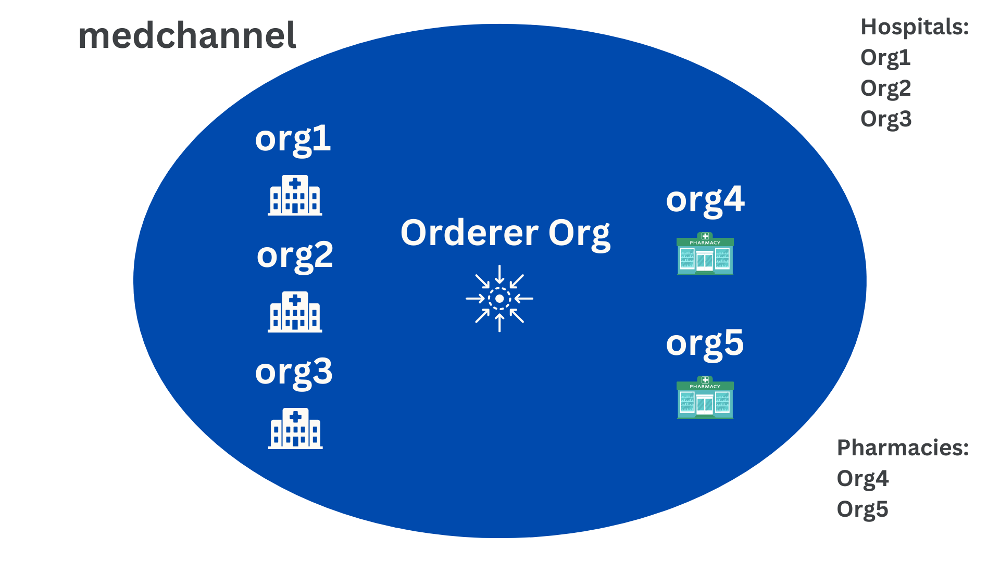

# Hyperledger Based Medical Prescription Authentication

## Network Topology

The network consists of 5 Peer Orginazations and 1 Orderer Organization with 1 channel joining them together.

Hospitals: Org1, Org2, Org3
Pharmacies: Org4, Org5

