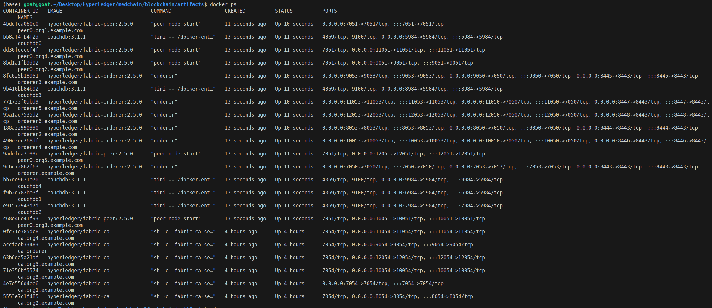
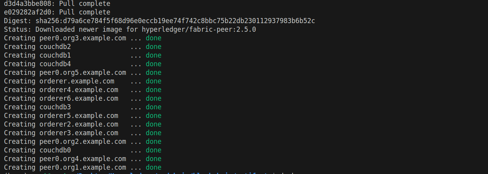
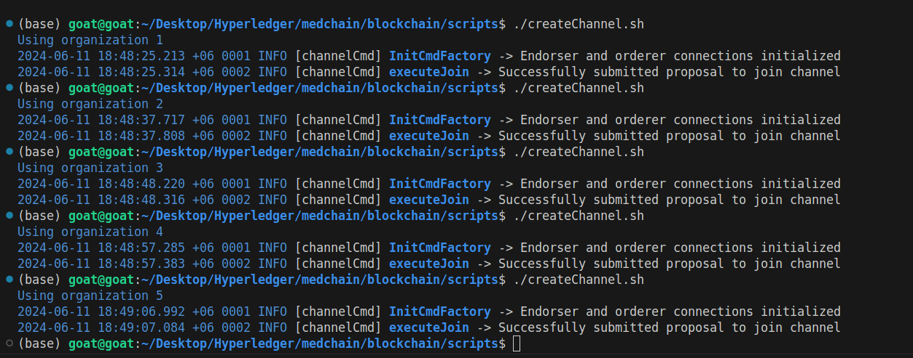

# Blockchain Progress

## CA Created

The Certificate Authorities (CA) were generated for each of the 6 organizations consisting of 5 Peer organizations and 1 Orderer organization.The CA running successfully as shown in the picture:

## Network Services Created

The network services include 6 CA, 6 Orderers, 5 Peers, 5 CouchDB. Remaining services that will be added later are the 5 Chaincode services for each of the 5 Peer Organizations.

## Medchain Channel Created

The medchain channel was created by joining the 5 peers to the channel.

